<h1 align="center"> GeoDiffuser: Geometry-Based Image Editing with Diffusion Models </h1>
<p align="center">
    <a href="https://arxiv.org/abs/2404.14403"></a>
    <a href="https://ivl.cs.brown.edu/research/geodiffuser.html"></a>
</p>

  <p align="center">
    <a href="https://rahulsajnani.github.io/"><strong>Rahul Sajnani</strong></a>
    &nbsp;&nbsp;
    <a href="https://www.linkedin.com/in/jeroenvanbaar"><strong>Jeroen Vanbaar</strong></a>
    &nbsp;&nbsp;
    <a href="https://umjcs.github.io/"><strong>Jie Min</strong></a>
    &nbsp;&nbsp;
    <a href="https://kdk132.github.io/"><strong>Kapil Katyal</strong></a>
    &nbsp;&nbsp;
    <a href="https://cs.brown.edu/people/ssrinath/"><strong>Srinath Sridhar</strong></a>
    &nbsp;&nbsp;
  </p>


<p align="center">
  <h4 align="center"> Geometry Edits </h4>
  <div align="center">
    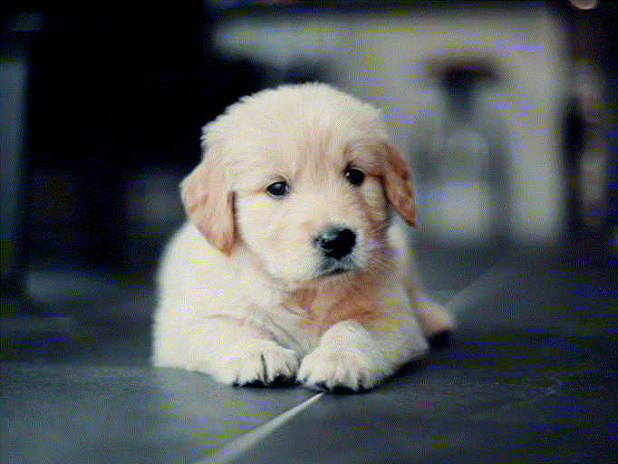
    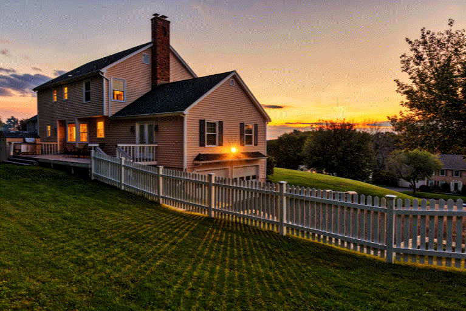
    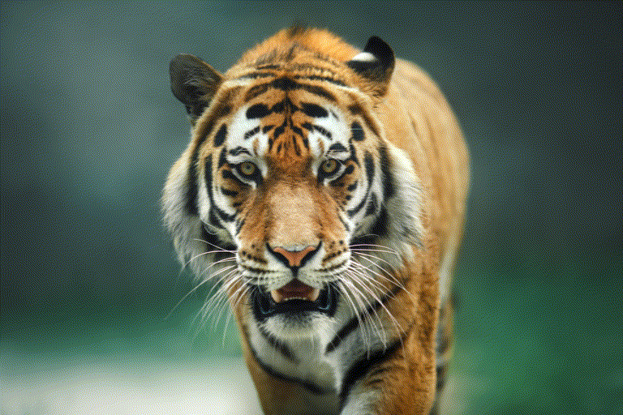
    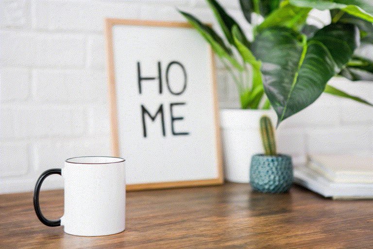
    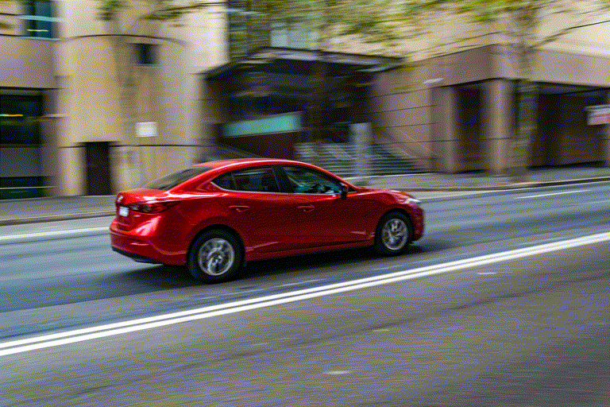
    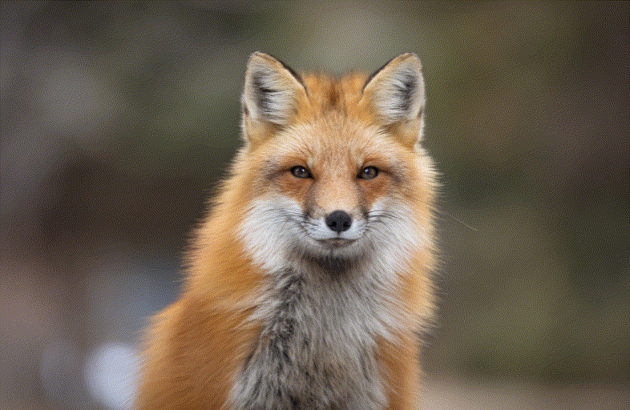
    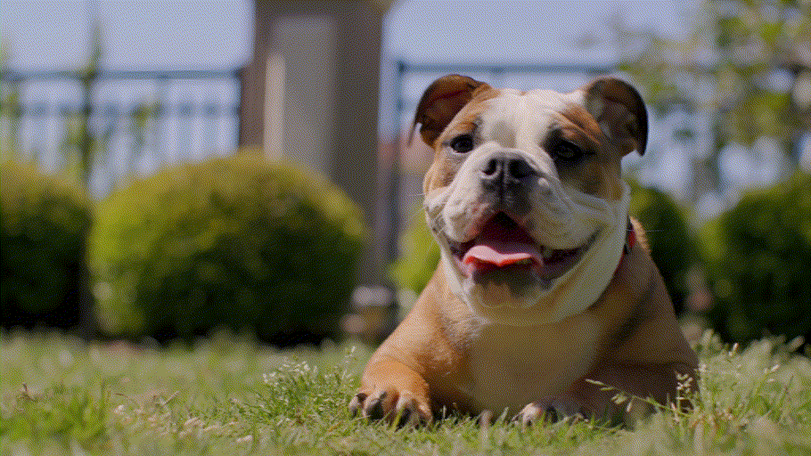
    
    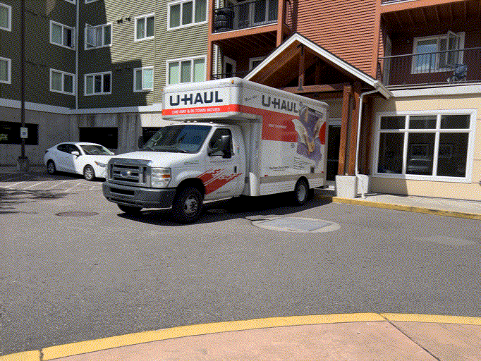
    
    
    
  </div>
  <h4 align="center"> Removal Edits </h4>
  <div align="center">
    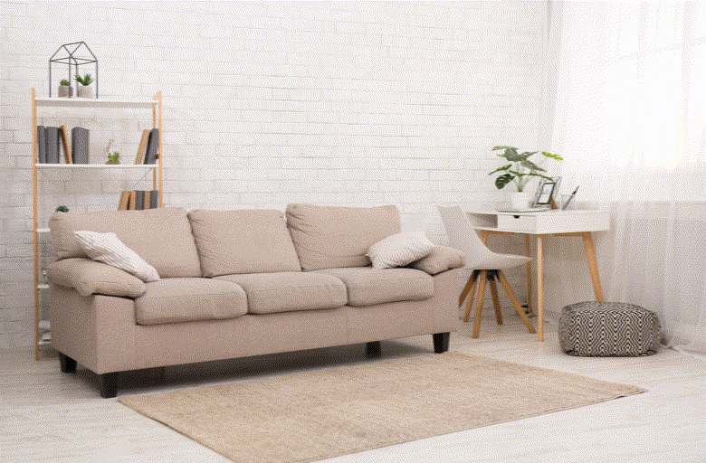
    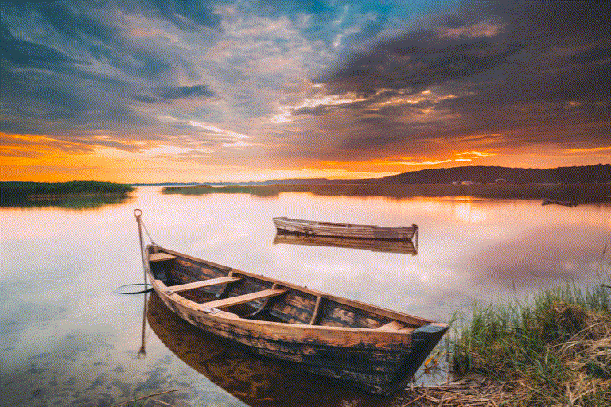
    
    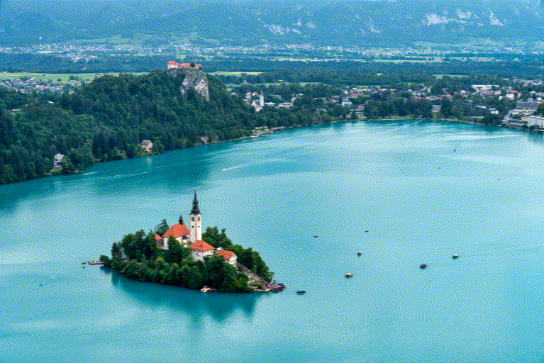
  </div>
  <br>
</p>

**Note: Code is still in maintenance. Releasing initial version.**

## Abstract
The success of image generative models has enabled us to build methods that can edit images based on text or other user input. However, these methods are bespoke, imprecise, require additional information, or are limited to only 2D image edits. We present GeoDiffuser, a zero-shot optimization-based method that unifies common 2D and 3D image-based object editing capabilities into a single method. Our key insight is to view image editing operations as geometric transformations. We show that these transformations can be directly incorporated into the attention layers in diffusion models to implicitly perform editing operations. Our training-free optimization method uses an objective function that seeks to preserve object style but generate plausible images, for instance with accurate lighting and shadows. It also inpaints disoccluded parts of the image where the object was originally located. Given a natural image and user input, we segment the foreground object using SAM and estimate a corresponding transform which is used by our optimization approach for editing. GeoDiffuser can perform common 2D and 3D edits like object translation, 3D rotation, and removal. We present quantitative results, including a perceptual study, that shows how our approach is better than existing methods. Visit [this https URL](https://ivl.cs.brown.edu/research/geodiffuser.html) for more information.


## New Features & To Do
- [x] Speed up code
- [x] Release Code
- [ ] Test Installation on new PC
- [ ] Release Editing Dataset
- [ ] Provide Editing Instructions
- [ ] Add support for v-prediction models
- [ ] Create a Flux Version of GeoDiffuser using FlowEdit/RF-Inversion


## Installation

```
# Creating the conda environment and loading it

conda env create -f ./GeoDiffuser/envs/torch2.1_environment.yml
conda activate GeoDiffuser
pip3 install --no-index --no-cache-dir pytorch3d -f https://dl.fbaipublicfiles.com/pytorch3d/packaging/wheels/py310_cu121_pyt210/download.html
```

## Download models for SAM
```
mkdir checkpoints
cd checkpoints
wget https://dl.fbaipublicfiles.com/segment_anything/sam_vit_h_4b8939.pth
cd ../
```


## Running GeoDiffuser
```
CUDA_VISIBLE_DEVICES=0 python3 geo_diff_ui.py
```


## Compute Requirements
This code requires about 20-24 GB of VRAM and can be run on the recent Nvidia 3090/4090 GPUs. This code was run and developed on a Linux System with CUDA 12.1. Authors would appreciate if the community can help improve this further.

## Citation
```
@InProceedings{sajnani2024geodiffuser,
  title={GeoDiffuser: Geometry-Based Image Editing with Diffusion Models}, 
  author={Rahul Sajnani and Jeroen Vanbaar and Jie Min and Kapil Katyal and Srinath Sridhar},
  booktitle = {IEEE/CVF Winter Conference on Applications of Computer Vision (WACV)},
  month = {March},
  year={2025},
}
```


